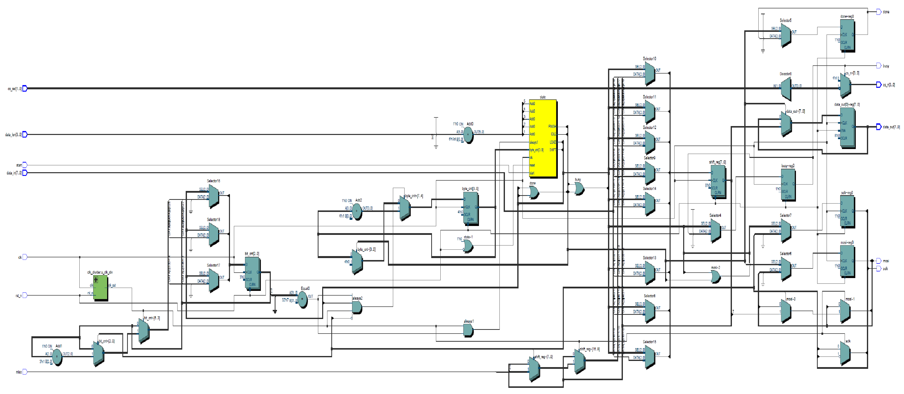
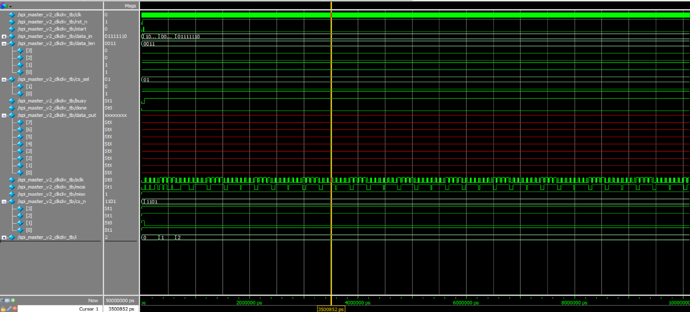

# SPI Master v2 with Clock Divider

This project implements a multi-byte **SPI Master controller** with a configurable **clock divider**, written in Verilog. It includes a complete testbench, RTL schematic, and waveform simulation output.

---

## 📁 File Overview

| Filename                       | Description                                      |
|-------------------------------|--------------------------------------------------|
| `spi_master_v2_clkdiv.v`      | Main SPI Master module with clock division       |
| `clk_divider.v`               | Parameterized clock divider module               |
| `spi_master_v2_clkdiv_tb.v`   | Testbench for transmitting 3 bytes of data       |
| `RTL_spi_master_v2_clkdiv.png` | RTL schematic captured from Quartus             |
| `wave_spi_master_v2_clkdiv_tb.png` | Simulation waveform image from ModelSim     |

---

## 🧩 RTL Diagram

Generated from Quartus RTL Viewer:

---

## 🌊 Simulation Waveform

Testbench simulates transmission of 3 bytes.
The waveform shows:
- Proper `sclk` generation
- Correct `mosi` shifting
- Assertion of `done` signal
- Output data (`data_out`) captured

---

## ✅ Features

- Multi-byte SPI transmission
- Parameterized:
  - Data width
  - Number of chip selects
- Onboard clock divider for flexible SPI clock frequency
- `busy` and `done` flags for transmission state tracking
- Supports multiple chip select lines (`cs_n`)

---

## ▶️ How to Simulate

You can use **ModelSim**, **QuestaSim**, or **Vivado Simulator**:

1. Compile all `.v` files
2. Set `spi_master_v2_clkdiv_tb` as the top-level module
3. Run simulation and observe key signals:
   - `sclk`, `mosi`, `cs_n`
   - `done` and `data_out`
